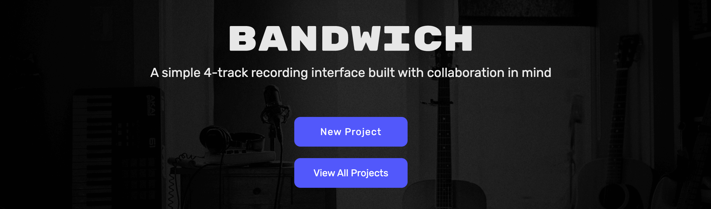

# Bandwich

## Description 

Bandwich is a simple 4-track interface built with collaboration in mind. A Bandwich audio workstation can be used to share song ideas between users or collaborate on audio tracks. The project utilizes [Recorder.js](https://github.com/mattdiamond/Recorderjs) to record audio files in the browser and stores the Base64 data in a SQL database.

## Table of Contents

* [Dependencies](#Dependencies)
* [Usage](#usage)
* [Credits](#credits)
* [License](#license)

## Dependencies
A package.json is included in the repo with all the necessary dependencies. 

## Usage 
To start recording click the link below!

[Bandwich](https://bandwich-app.herokuapp.com/)

A user can either click on `New Project` to create a blank workstation or click `View All Projects` to search for existing projects. New projects will be given a randomly generated name which can be changed at any point by clicking on the title. 
The workstation follows the same functionality of a classic 4 track tape recorder. To those not familiar with recording DAWs here is a walkthrough: 

[Bandwich Demo](https://drive.google.com/file/d/1xfoNn7JXKiiwWl5DcbDmGuiQyss56FQb/view)

## Credits

* [Recorder.js](https://www.npmjs.com/package/recorder-js)
* [Octavian Naicu](https://blog.addpipe.com/using-recorder-js-to-capture-wav-audio-in-your-html5-web-site/) 
* [Volume-meter.js](https://github.com/cwilso/volume-meter) 
* [Title Gen](https://github.com/dgtlctzn/API-title-generation) 
* [Body-parser](https://www.npmjs.com/package/body-parser) 
* [Wavefile](https://www.npmjs.com/package/wavefile) 

## License

This project is covered under the GNU license

Copyright (c) 2020 Joseph Perry, Kai Reed, Andrew Stewart, and Patrick Hannan