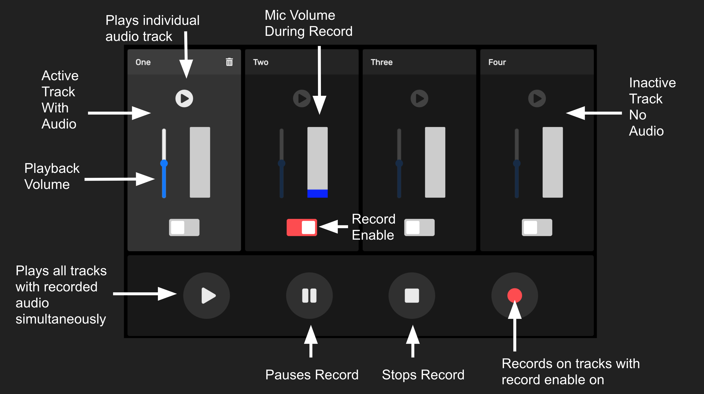

# bandwich

## Description 

This project is a web app that will all the user to make collaborative music projects. Bandwich allows musicians to create their own workstations where they can record songs on a four track. These projects are available for friends and other user to come collaborate their own recordings. In a future update, projects will require passwords so that the owner of the project can determine who can edit their project.

## Table of Contents

* [Installation](#installation)
* [Usage](#usage)
* [Credits](#credits)
* [License](#license)

## Installation
The user does not need to install anything to use this application if they choose to use the deployed Heruko application. This can be accessed [here](https://bandwich-app.herokuapp.com/).

However, if the user wants to locally host the app, they must download the files from this repository. Those can be accessed [here](https://github.com/dgtlctzn/bandwich).

Once the user downloads these files, they must open the files in VS Code. In VS Code, the user will run a new terminal. In the terminal, the user will change their working directory to the current directory. 

Run "npm install" to install the app.

## Usage 
*If the user uses the app locally, run the command node server.js in the terminal, then open localhost:8080 in a web browser.* 

Once in the app, the user will be placed on the home page, with the option to create a new project or to look through existing songs. When creating a new project, the user is sent to the project workstation. On here, there will be four tracks, along with a play/pause button for each track and a row of play, pause, stop recording, and start recording buttons that control the whole project. 

To record, select which track to record on and press the record button on the right side of the button row, and begin recording your song. Each song can be up to 30 seconds. When the song is done, press the stop button. To hear the song back, press the play/pause button on the desired track.

To change the name of your song, click the randomly generated title and enter a new name. When done, press the enter key.

The navbar on the top left corner of the page will allow the user to go back to the home page or to the song directory. 

Below is a image of how the workstation will look.

To view other songs, go to the song directory. The user can look through all the songs in a list or if they know the title of the project they want to work on, the user can search the title in the search bar. They will then be redirected to a page that either has a link to the desired project, or if the search doesn't exist they will be redirected to a no results page.

<!-- Below is a image of how the song directory will look.
 -->

## Credits

* [Node.js](https://nodejs.org/en/)
* [MySQL](https://www.npmjs.com/package/mysql)
* [Recorder.js](https://www.npmjs.com/package/recorder-js)
* [Octavian Naicu](https://blog.addpipe.com/using-recorder-js-to-capture-wav-audio-in-your-html5-web-site/) 
* [Volume-meter.js](https://github.com/cwilso/volume-meter) 
* [Random-words](https://www.npmjs.com/package/random-words) 
* [Body-parser](https://www.npmjs.com/package/body-parser) 
* [Wavefile](https://www.npmjs.com/package/wavefile) 

## License

MIT License

Copyright (c) 2020 Joseph Perry, Kai Reed, Andrew Stewart, and Patrick Hannan

Permission is hereby granted, free of charge, to any person obtaining a copy of this software and associated documentation files (the "Software"), to deal in the Software without restriction, including without limitation the rights to use, copy, modify, merge, publish, distribute, sublicense, and/or sell copies of the Software, and to permit persons to whom the Software is furnished to do so, subject to the following conditions:

The above copyright notice and this permission notice shall be included in all copies or substantial portions of the Software.

THE SOFTWARE IS PROVIDED "AS IS", WITHOUT WARRANTY OF ANY KIND, EXPRESS OR IMPLIED, INCLUDING BUT NOT LIMITED TO THE WARRANTIES OF MERCHANTABILITY, FITNESS FOR A PARTICULAR PURPOSE AND NONINFRINGEMENT. IN NO EVENT SHALL THE AUTHORS OR COPYRIGHT HOLDERS BE LIABLE FOR ANY CLAIM, DAMAGES OR OTHER LIABILITY, WHETHER IN AN ACTION OF CONTRACT, TORT OR OTHERWISE, ARISING FROM, OUT OF OR IN CONNECTION WITH THE SOFTWARE OR THE USE OR OTHER DEALINGS IN THE SOFTWARE.